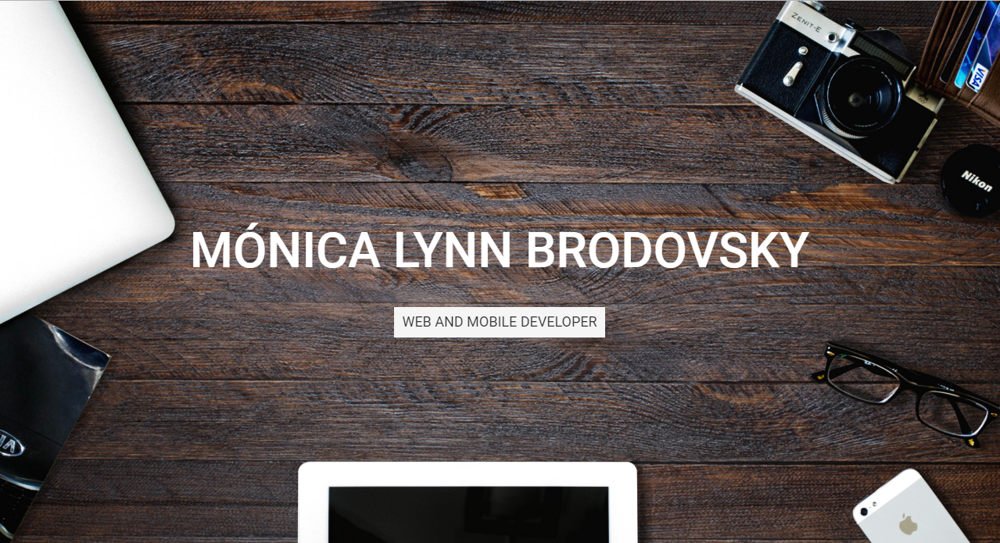
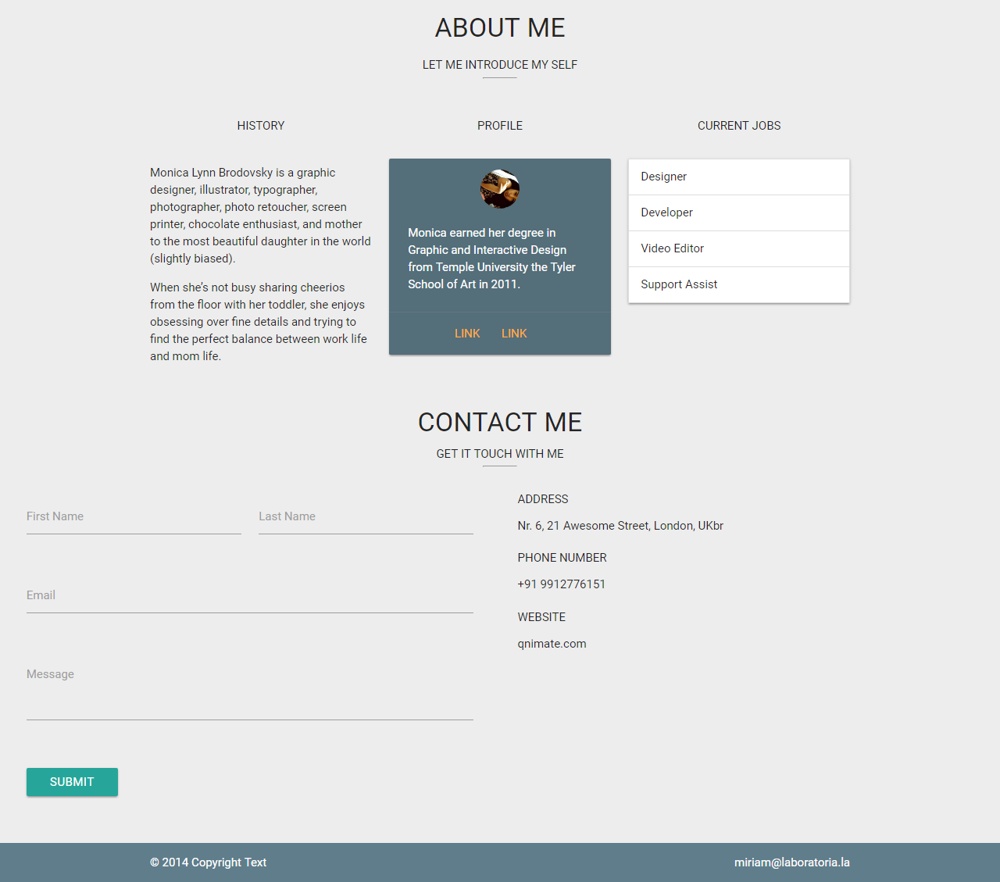
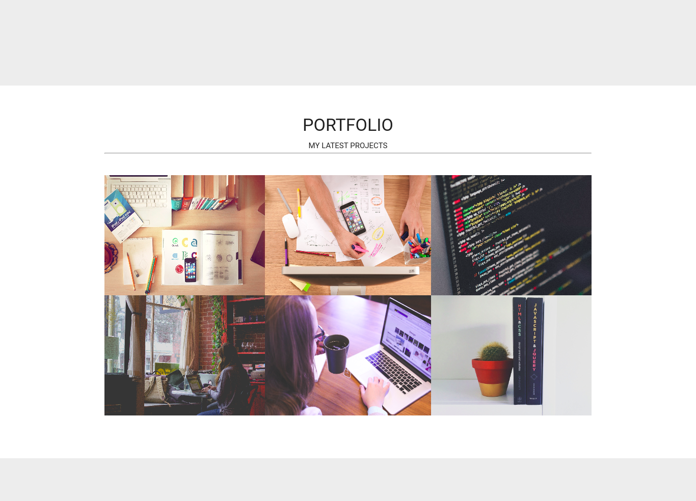

# PORTAFOLIO usando MATERIALIZE
Este proyecto se realizó como un reto en equipo


## Desarrollo con:
```sh
  - HTML
  - JS
  - CSS
  - MATERIALIZE
```

## Descripción
  Se decidió realizar la consigna de portafolio de una persona haciendo uso del framework MATERIALIZE, ya que nos ahorraba     acciones a realizar.

+ BANNER  
  
Se realizazó la portada del banner mostrado como fondo completo para cada ordenador.

+ ABOUT  
  
Se completo ésta sección con una plantilla MATERIALIZE.

+ PORTFOLIO  
  
+ CONTACT
Aqui vemos la sección de contactos:

+ GH-PAGES
Luego de finalizar el código podemos visualizar nuestro portafolio aqui:

+ Visualizacion Final 
  
### Members

- Marilu Llamoca


- Miriam Mendoza 


- Arantza Burga

