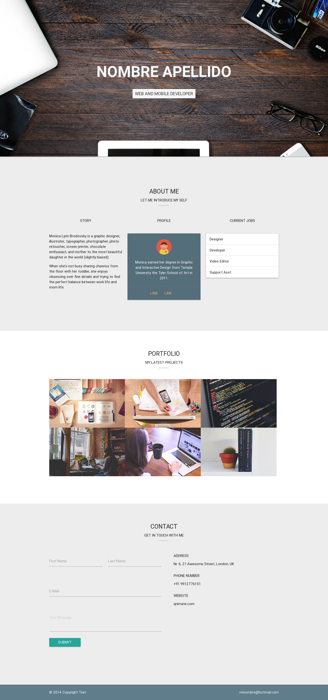

# PORTAFOLIO usando MATERIALIZE
Este proyecto se realizó como un reto en equipo

## Descripción
  Se decidió realizar la consigna de portafolio de una persona haciendo uso del framework MATERIALIZE, ya que nos ahorrará acciones a realizar
## Objetivo
  Relizar un portafolio con el framework materialize, el cual permitirá reutilizar clases para armar la página web
## Desarrollado
```sh
  - HTML
  - JS
  - CSS
  - MATERIALIZE
```

+ BANNER  
  
Se realizazó la portada del banner mostrado como fondo completo para cada ordenador.

+ ABOUT  
  
Se completo ésta sección con una plantilla MATERIALIZE.

+ PORTFOLIO  
  
+ CONTACT
 
Aqui vemos la sección de contactos:

+ GH-PAGES
Luego de finalizar el código podemos visualizar nuestro portafolio aqui:

+ Visualizacion Final 
  
## Equipo

- Marilu Llamoca


- Miriam Mendoza 


- Arantza Burga


`Nota`: Este proyecto está subido al GH-PAGES [aquí](https://mgmp2.github.io/PortfolioMaterialize/).

